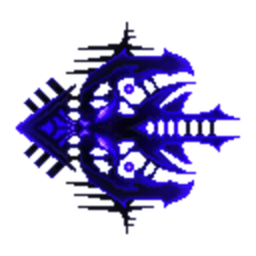
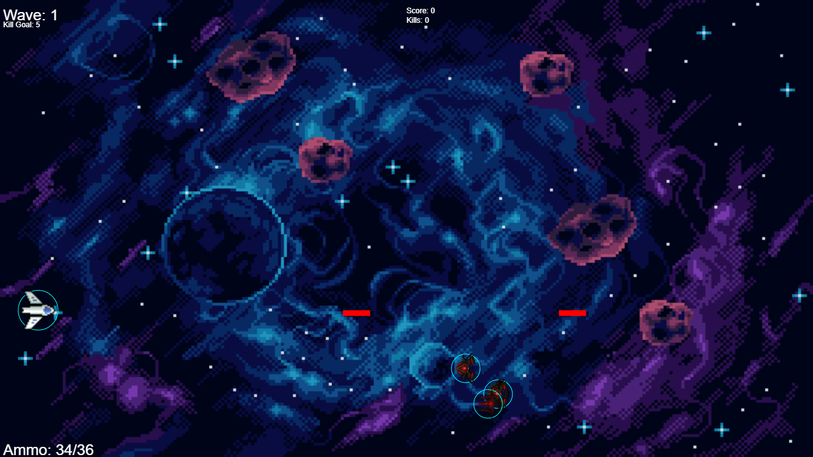

<div align="center">

  

  # Navigators

  

  <br><br>

  Welcome to **Navigators**, a simple 2D space shooter built with [p5.js](https://p5js.org/) where you control a spaceship navigating through space while defending against waves of enemy ships. This game was created in 10 hours as a class project.

  🚀 **[Play Live in Browser on GitHub Pages](https://priestytheplushie.github.io/Navigators/)**

</div>

---

## The Repository

This repository has **2** branches: the `main` branch, which houses the polished version, and the `legacy` branch, which houses the original project made for class (lacking Endless Mode and extra polish). For a breakdown of changes, see the table below:

| Feature | Legacy (`legacy`) | Main (`main`) |
| :--- | :---: | :---: |
| Core Gameplay | ✔ | ✔ |
| 10 Waves | ✔ | ✔ |
| 3 Enemy Types | ✔ | ✔ |
| Health Pickups | ✔ | ✔ |
| Score Tracking | ✔ | ✔ |
| Endless Mode | — | ✔ |
| Loading Screen | — | ✔ |
| LocalStorage Saving | — | ✔ |
| Boss Movement Tweaks | — | ✔ |

Feel free to check out both versions, but the `PySide6` desktop wrapper and GitHub Pages site point to the **main** branch.

---

## How to Play

Use `W` / `S` or the **Arrow Keys** to maneuver your ship up and down, press `X` or `Space` to shoot, and `R` to reload. Your goal is to defeat enemies to reach the **kill goal** and advance to the next wave. Hold the line—**do not let the enemies move off screen**. You can **ram** into enemies to defeat them, but you will take damage in return.

You have **5 HP**, with the **Shield** representing 2 HP and the ship's visual icon representing the remaining 3 HP:

- **5 HP**: 36 max ammo, Full HP, Cyan Shield
- **4 HP**: 32 max ammo, Red Shield
- **3 HP**: 24 max ammo, No Shield
- **2 HP**: 20 max ammo, Slightly damaged icon
- **1 HP**: 16 max ammo, Very damaged icon

You restore HP and automatically reload all ammo upon clearing a wave. If your ammo drops to **0**, you will automatically start reloading. Reloading reduces your vertical movement speed by **40%**, so be careful and make sure to reload safely.

Complete all **10 waves** to unlock **Endless Mode**. The 10th wave features a boss, so watch out! You can also pick up health packs dropped by enemies to heal and restore your HP.

---

## Enemy Types

### Normal Enemies
These enemies are **red** and do not have any attacks. They move straight to the left of the screen—DO NOT let them cross!

### Shooters
These enemies are **green** and fire lasers straight ahead toward you. They have 1 less HP than normal enemies.

### Boss
These **blue** enemies spawn on Wave 10 and in Endless Mode. They shoot like Shooter enemies AND charge forward to ram into you, dealing damage. Dodging is key! The boss moves up and down while shooting, but locks in place right before charging, giving you an opening to attack.

---

## Installing and Running

You can grab compiled desktop builds created with `PySide6` and `QWebEngine` under [Releases](https://github.com/Priestytheplushie/Navigators/releases) or play directly in your web browser at the [GitHub Pages Site](https://priestytheplushie.github.io/Navigators/).

To run the code locally, first **clone** the repository:

```bash
git clone https://github.com/Priestytheplushie/Navigators.git
cd Navigators
```

### Option A: Python Web Server (Works for both Main & Legacy)
```bash
cd web
python3 -m http.server 8000
```
Then open `http://localhost:8000` in your browser.

### Option B: PySide6 Desktop Wrapper
Ensure you have `PySide6` installed (`pip install PySide6`), then run:
```bash
python main.py
```

---

## Credits 

- **Code**: Created by me and Hirschc
- **Space Background**: [ansimuz](https://ansimuz.itch.io)
- **Enemy Sprites**: [Gustavo Vituri](https://gvituri.itch.io)
- **Player Sprites**: [Frostwindz](https://frostwindz.itch.io)
- **Audio & SFX**: Sound assets from [freesound.org](https://freesound.org) (CC0 License)

*Assets used under free / open-source license terms (attribution optional, but appreciated).*

---

## Contributing and Development 

This project was built for a class, and as such there's really no motivation for us to continue developing it beyond this point. This is considered the final version of the project, so we won't be taking contributions or developing it further. Feel free to fork this project, use it as an example, or do whatever you want with it!

---

## License 

This project is licensed under the MIT License — see the [LICENSE](LICENSE.md) file for details.
